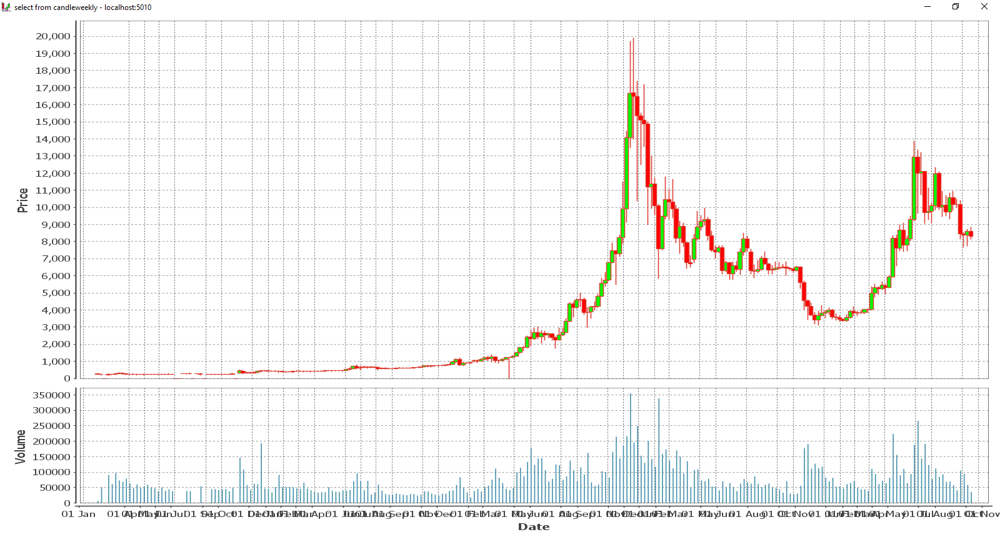
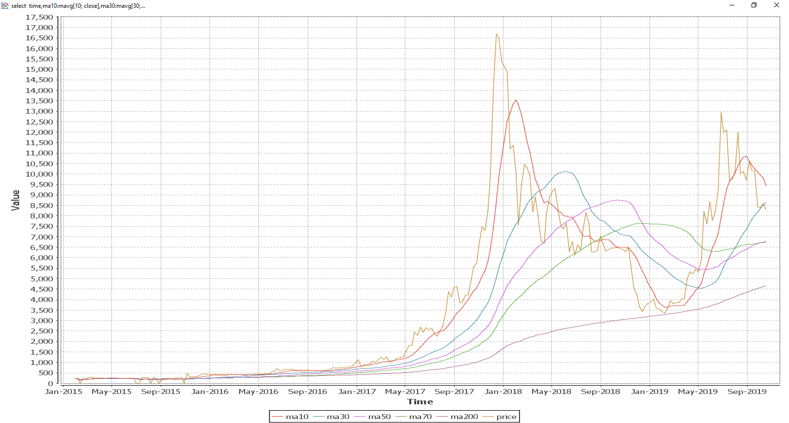
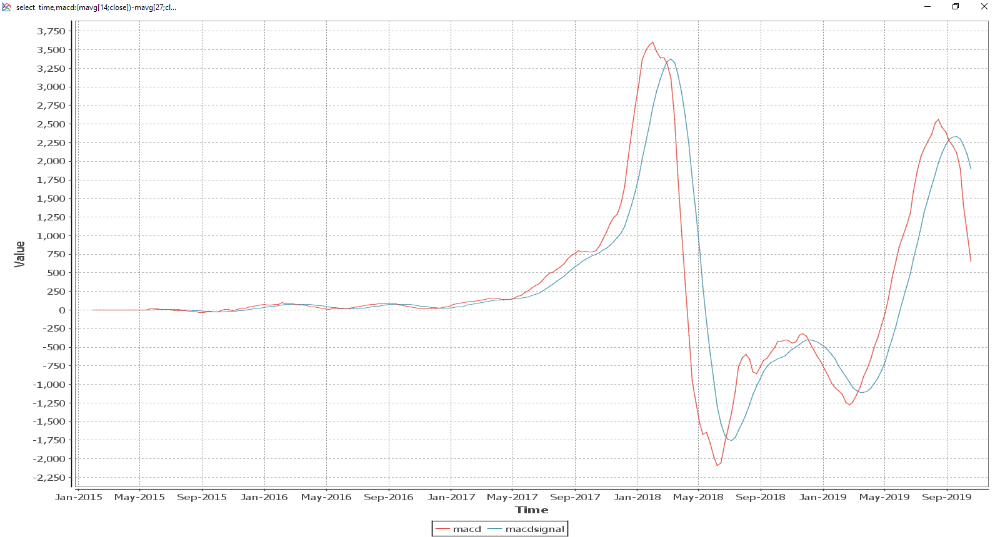
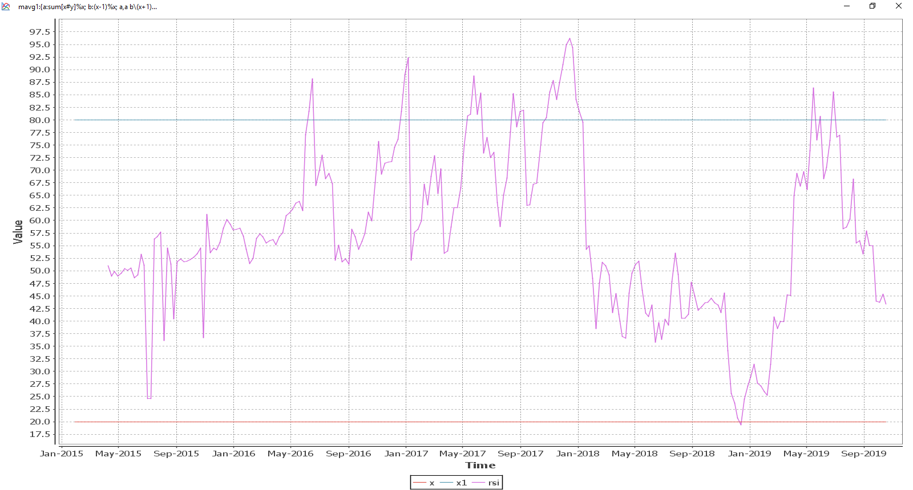

# QTrends

Snapshot trend analysis. For use as an overview to guide finer grain market trading.

Pre-requisites:

KDB+ (https://kx.com/connect-with-us/download/)

Start with:

\l qTrends.q

Load qstudio (http://www.timestored.com/qstudio/) for analysis
# Candles
select from candleweekly

# Moving averages
select  time,ma10:mavg[10; close],ma30:mavg[30; close],ma50:mavg[50; close],ma70:mavg[70; close],ma200:mavg[200; close],price:close from candleweekly 

# Moving Average Convergence Divergence (MACD)  
select  time,macd:(mavg[14;close])-mavg[27;close],  macdsignal:mavg[10;(mavg[14;close])-mavg[27;close]] from candleweekly

# Relative Strength Index (RSI)   
mavg1:{a:sum[x#y]%x; b:(x-1)%x; a,a b\(x+1)_y%x};
calcRsi:{100*rs%1+rs:mavg1[x;y*y>0]%mavg1[x;abs y*(y:y-prev y)<0]};
select  time,20,80,  rsi:((10#0Nf),calcRsi[10;close])from candleweekly 

# Karma Jar

BTC - 112eMCQJUkUz7kvxDSFCGf1nnFJZ61CE4W

LTC - LR3BfiS77dZcp3KrEkfbXJS7U2vBoMFS7A

ZEC - t1bQpcWAuSg3CkBs29kegBPXvSRSaHqhy2b

XLM - GAHK7EEG2WWHVKDNT4CEQFZGKF2LGDSW2IVM4S5DP42RBW3K6BTODB4A Memo: 1015040538

Nano - nano_1ca5fxd7uk3t61ghjnfd59icxg4ohmbusjthb7supxh3ufef1sykmq77awzh

XRP - rEb8TK3gBgk5auZkwc6sHnwrGVJH8DuaLh Tag: 103535357

EOS - binancecleos Memo: 103117718

# Recommended links

Getting started - Coinbase - https://www.coinbase.com/join/bradle_6r

Portfolio balance - Binance - www.binance.com/en/register?ref=LTUMGDDC

Futures trading - Deribit - https://www.deribit.com/reg-8106.6912

Cold wallet - https://atomicWallet.io?kid=12GR52 (promo 12GR52) - https://hodler.tech/

Learn to earn (coinbase users) - Stellar - https://coinbase.com/earn/xlm/invite/vps5dfzt
                               -  EOS - https://coinbase.com/earn/eos/invite/xdbgswqk
                               
                               
